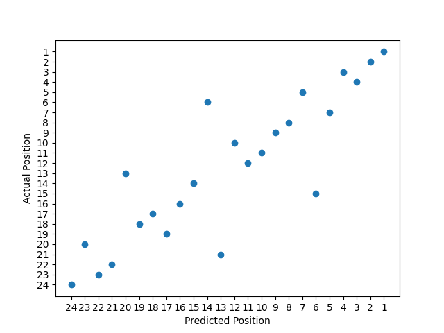
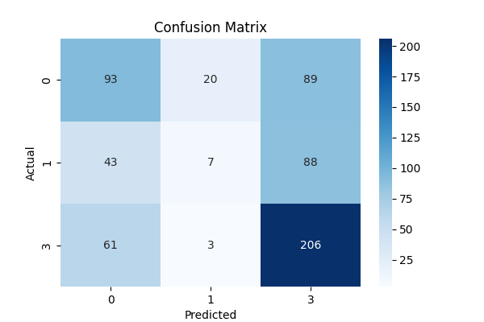

# Season Predict:

Program to predict the final league table based on teams' stats at the halfway stage of the season.

The program first asks the user if they would like to create training data or use previously collected
data to train a model and predict a league season

The function used to collect data (create_training_or_testing_data) uses sofascore to get information 
from the matches up to halfway through a season. The data is then saved to a json file of the user's 
choosing.

Stats collected include:
- position (at the halfway stage)
- goals for (at the halfway stage)
- goals against (at the halfway stage)
- goal difference (at the halfway stage)
- points (at the halfway stage)
- points away from team in first (at the halfway stage)
- points away from team in last (at the halfway stage)
- final league position (at the end of the season)

The next function (season_predict) allows the user to input two json files created by the previous
function, one for training and one for testing. The function then trains a model on the training data
and predicts the final league table for the testing data. It uses the RandomForestClassifier function 
of SciKitLearn to train the model and make the prediction. The function returns the predicted table, 
including what the model thinks is the probability of each team finishing in their relative position 
(shown below is the result of predicting the 23/24 EFL Championship season).
```
                    Team  Assigned Position  Probability
0         Leicester City                  1         0.82
1           Ipswich Town                  2         0.26
3            Southampton                  3         0.14
2           Leeds United                  4         0.21
5              Hull City                  5         0.16
6                Watford                  6         0.29
4   West Bromwich Albion                  7         0.10
10         Middlesbrough                  8         0.26
14         Coventry City                  9         0.21
11          Bristol City                 10         0.18
9           Cardiff City                 11         0.17
12     Preston North End                 12         0.15
16       Plymouth Argyle                 13         0.15
7           Norwich City                 14         0.26
15          Swansea City                 15         0.28
8             Sunderland                 16         0.07
13      Blackburn Rovers                 17         0.21
18            Stoke City                 18         0.16
21   Queens Park Rangers                 19         0.29
19              Millwall                 20         0.21
17       Birmingham City                 21         0.23
20     Huddersfield Town                 22         0.36
22   Sheffield Wednesday                 23         0.21
23      Rotherham United                 24         0.65
Model accuracy: 0.25
Correlation Coefficient: 0.87304
```
As you can see, the model also outputs the final accuracy of the model and the correlation coefficient

In addition to this, it also outputs a graph of the predicted final league table vs the actual final 
league table:



This is to make it easier to see how well the model has done in predicting the final league table.

I think the main problem I ran into when making this model is things affecting the final league table 
that I can't account for (e.g, points deductions, player transfers, major injuries, etc.) especially
because things like points deductions have an effect on the training data. This is something that I
probably could fix in the future, because sofascore does a pretty good job of displaying when there
have been various points deductions.

A problem that I had but found a solution for is that if you're trying to collect data for a season 
which isn't completely finished, it's possible that postponed games could lead to incomplete data. I 
solved this by allowing the user to input a scoreline for games that had not been played yet. This is 
obviously not a perfect solution, but it's the best I could think of. It also means that the user can
use the model on each different outcome of the game to see how it affects the final league table and 
the probabilities of each team.

# Match Predict:

Program to predict the outcome of a match based on both teams pregame form, pregame standings, and 
bookies odds.

The program first asks the user if they would like to create training data, train a model and evaluate
how accurate it is, or predict the outcome of an individual match.

If the user chooses to create data, the program asks what tournament they would like to use. It then
presents a list of eligible league seasons for that tournament and asks the user to choose one.
Then it goes through all the matches in that season and collects the data from each match. It only
uses matches where there have been five or more matches played by each team in order to get accurate
form data. The data collected includes:

- goal difference from the home team's last game
- goal difference from the home team's game two games ago
- goal difference from the home team's game three games ago
- goal difference from the home team's game four games ago
- goal difference from the home team's game five games ago
- home teams league position before the match
- goal difference from the away team's last game
- goal difference from the away team's game two games ago
- goal difference from the away team's game three games ago
- goal difference from the away team's game four games ago
- goal difference from the away team's game five games ago
- away teams league position before the match
- the league round number of the match
- the result of the match
- the bookies odds for the home team to win
- the bookies odds for the draw
- the bookies odds for the away team to win

The program then saves this data to a json file of the user's choosing.

If the user chooses to train and evaluate a model, the program asks for the json file containing the 
training data. It then trains a model on this data also using the RandomForestClassifier function of 
SciKitLearn. It then evaluates the model on the training data and outputs the accuracy of the model.
The way it evaluates the model is by presenting a confusion matrix of the model's predictions vs the
actual results of the matches. This is something I may change in the future because I'm not sure that
it's the best way to evaluate the model.

This is the result of training the model on multiple previous premier league seasons:

```
Accuracy: 0.5016
Trained on 1238 samples, tested on 610 samples.
```

If the user chooses to predict the outcome of a match, the program again asks for the json file 
containing the training data. It then asks the user if they would like to predict a match that has 
already happened or a match that hasn't happened yet. If they choose the first option, it will ask for
a home team and an away team, it will then give them a list of eligible matches from the past. If they 
choose the second option, it asks the user to manually input the data for the match they would like to 
predict. This is something I may change in the future because its quite tedious having to manually 
enter things like the match odds and the previous form, and I believe it would be relatively simple
to automate. It then uses the model to predict the outcome of the match and outputs the result. 
It also outputs the probability of each outcome happening.

This is the result of predicting the outcome of a match between Liverpool and Manchester United:
```
Probability of Liverpool winning: 0.26
Probability of a draw: 0.71
Probability of Manchester United winning: 0.03
Trained on 1848 samples.
```